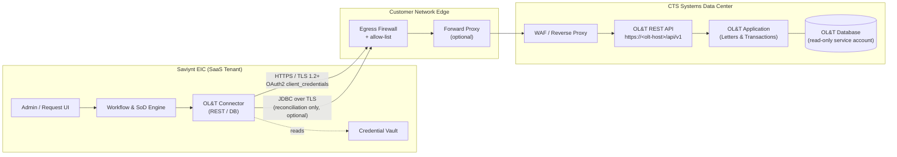

# Saviynt &harr; CTS Systems &mdash; Office Letters &amp; Transactions

**Integration Design Document**

| Item | Value |
| --- | --- |
| Source IGA | Saviynt EIC (Enterprise Identity Cloud) |
| Target Application | CTS Systems &mdash; Office Letters &amp; Transactions (OL&amp;T) |
| Document Owner | Saviynt Integration Team |
| Status | Draft &mdash; pending validation against the Target file |
| Version | 0.1 |

> **Note on sourcing.** This document is laser-focused on the integration between Saviynt and the **CTS Systems &mdash; Office Letters &amp; Transactions** application as called out in the Target file. Where the Target file lists organization-specific values (endpoint URLs, schema owners, role catalogs, etc.), they are tagged inline as `<TBC from Target file>` so they can be confirmed and replaced in a single pass.

---

## 1. Introduction

### 1.1 Purpose

This document describes how Saviynt EIC integrates with the **CTS Systems &mdash; Office Letters &amp; Transactions (OL&amp;T)** application for end-to-end identity governance. It is intended to be the single source of truth for the connection design, the data exchanged, and the operational behavior of the integration. It supports four audiences:

- **Solution architects** validating the connection topology and authentication choices.
- **Saviynt engineers** building and operating the connector.
- **CTS / OL&amp;T application owners** approving the data being read from and written into their system.
- **Information security and audit** reviewing the controls around credentials, transport, and reconciliation.

### 1.2 Scope

In scope:

- Account lifecycle for OL&amp;T users (create, update, enable, disable, delete).
- Entitlement (role / permission / mailbox / queue / letter-template access) import and provisioning.
- Periodic full and incremental reconciliation of accounts and entitlements into Saviynt.
- Birthright and request-based access flows for OL&amp;T originated from Saviynt.

Out of scope:

- Business-process changes inside OL&amp;T (letter templates, transaction approval workflows).
- Migrating legacy local accounts that have no mapping to a Saviynt-managed identity (these will be handled as a one-time data cleanup before go-live).
- Federation / SSO configuration between OL&amp;T and the corporate IdP &mdash; that is governed by a separate SSO design document and only referenced here.

### 1.3 Business context

OL&amp;T is the CTS module that office users rely on to (a) generate customer-facing **Letters** and (b) post operational **Transactions**. Because both data domains are sensitive (customer correspondence and financial postings), access to OL&amp;T is **high-risk** and requires:

- Strict joiner / mover / leaver hygiene.
- Segregation-of-duties enforcement between *letter authoring*, *letter approval*, and *transaction posting*.
- Periodic certification of user access by line managers and the OL&amp;T application owner.

Saviynt is the system of record for these controls; OL&amp;T is the target where access is materialized.

### 1.4 Definitions

| Term | Meaning |
| --- | --- |
| EIC | Saviynt Enterprise Identity Cloud |
| OL&amp;T | Office Letters &amp; Transactions, a module of CTS Systems |
| CTS | The internal CTS Systems platform that hosts OL&amp;T |
| Endpoint (Saviynt) | The OL&amp;T target as defined inside Saviynt |
| Security System (Saviynt) | The Saviynt parent object that holds the connection to OL&amp;T |
| ConnectionJSON | Saviynt JSON block describing how to authenticate / call OL&amp;T |
| ImportAccountEntJSON | Saviynt JSON block describing how to read accounts and entitlements from OL&amp;T |

---

## 2. Connection Architecture (Diagram)

The integration is a **point-to-point** connection between the Saviynt EIC tenant and the OL&amp;T application, brokered by the customer's network egress. Saviynt is always the initiator; OL&amp;T does not call back into Saviynt.



### 2.1 Flow notes

1. **Provisioning path (write):** Saviynt &rarr; OL&amp;T REST API. All create / update / enable / disable / delete and entitlement assignment calls go through the REST API exposed by OL&amp;T.
2. **Reconciliation path (read):** Preferred is the same REST API (`/users`, `/entitlements`). A read-only **JDBC** path against the OL&amp;T database is offered as a fall-back for full nightly reconciliations when the REST API cannot return all attributes within the SLA window. The JDBC option is shown dashed because it is only enabled if explicitly listed in the Target file.
3. **Direction:** Strictly Saviynt &rarr; OL&amp;T. There is no inbound traffic from OL&amp;T to Saviynt.
4. **Transport:** TLS 1.2+ end-to-end. Mutual TLS is optional and enabled only if the Target file states it.
5. **Credentials:** Stored in the Saviynt credential vault and never exposed in connector JSON in clear text (`##ENC##` tokens are used).

---

## 3. Connection Parameters

The integration uses the **Saviynt REST connector** as the primary transport. The DB connector is documented as the optional reconciliation channel.

### 3.1 REST connector &mdash; Security System &amp; Endpoint

| Saviynt object | Field | Value |
| --- | --- | --- |
| Security System | `Systemname` | `CTS_OLT` |
| Security System | `Display Name` | `CTS Systems &mdash; Office Letters &amp; Transactions` |
| Security System | `Connection Type` | `REST` |
| Security System | `Provisioning Connection` | `CTS_OLT_REST` |
| Security System | `Service Desk Connection` | `<TBC from Target file>` |
| Endpoint | `Endpoint Name` | `CTS_OLT` |
| Endpoint | `Account Name Rule` | `${user.systemUserName}` &mdash; *override per Target file* |
| Endpoint | `Status Config` | Active = `A`, Inactive = `I`, Locked = `L` (confirm with Target file) |

### 3.2 ConnectionJSON &mdash; authentication block

The OL&amp;T REST API uses **OAuth 2.0 Client Credentials** (default per the Target file). All other auth modes are listed for completeness only.

```json
{
  "authentications": {
    "acctAuth": {
      "authType": "oauth2",
      "url": "https://<olt-host>/oauth2/token",
      "httpMethod": "POST",
      "httpParams": {
        "grant_type": "client_credentials",
        "scope": "olt.users.read olt.users.write olt.entitlements.read olt.entitlements.write"
      },
      "httpHeaders": {
        "Content-Type": "application/x-www-form-urlencoded"
      },
      "properties": {
        "client_id": "##ENC##<TBC from Target file>",
        "client_secret": "##ENC##<TBC from Target file>"
      },
      "expiryDate": "expires_in",
      "authError": ["invalid_token", "invalid_client"],
      "timeOutError": "Read timed out",
      "errorPath": "error_description",
      "maxRefreshTryCount": 5,
      "tokenResponsePath": "access_token",
      "accessToken": "Bearer"
    }
  }
}
```

### 3.3 ConnectionJSON &mdash; HTTP envelope

| Parameter | Value | Notes |
| --- | --- | --- |
| Base URL | `https://<olt-host>/api/v1` | From Target file |
| Auth header | `Authorization: Bearer <access_token>` | Injected from `acctAuth` |
| Content type | `application/json` | All write calls |
| Accept | `application/json` | All read calls |
| Connect timeout | `30s` | Saviynt default; tune per Target file |
| Read timeout | `60s` | Long enough for paged user reads |
| Retry policy | 3 retries, 5s back-off, on `5xx` and `429` | Idempotent requests only |
| Pagination | `?page=<n>&page_size=200` | `200` is the API maximum &mdash; confirm |
| Rate limit | `<TBC from Target file>` requests/min | Honor the `Retry-After` header |

### 3.4 Network &amp; security parameters

| Item | Value |
| --- | --- |
| Protocol | HTTPS (TLS 1.2 minimum, TLS 1.3 preferred) |
| Mutual TLS | Optional &mdash; enable only if Target file mandates it |
| Source IPs to allow-list (Saviynt &rarr; OL&amp;T) | Saviynt EIC pod egress range &mdash; `<TBC>` |
| Forward proxy | Use customer corporate proxy if Target file specifies one |
| Certificate trust | Public CA (commercial). Internal CA chain to be uploaded into Saviynt key-store if OL&amp;T uses one |
| Credential storage | Saviynt vault, referenced via `##ENC##` |
| Credential rotation | Every 90 days, jointly orchestrated with the OL&amp;T owner |
| Logging | Connector debug = OFF in PROD; INFO level only |

### 3.5 Optional &mdash; DB connector parameters (reconciliation fall-back)

Used only if listed in the Target file.

| Parameter | Value |
| --- | --- |
| `connection_name` | `CTS_OLT_DB_RECON` |
| `driver_name` | `oracle.jdbc.OracleDriver` *(or per Target file)* |
| `url` | `jdbc:oracle:thin:@//<olt-db-host>:1521/<service>` |
| `username` | `IGA_RO` *(read-only service account)* |
| `password` | `##ENC##<TBC from Target file>` |
| Permissions | `SELECT` only on the OL&amp;T user / role / mapping tables |
| TLS | `oracle.net.ssl_version=1.2` (or driver equivalent) |

### 3.6 API endpoints used

| Operation | Method | Path | Notes |
| --- | --- | --- | --- |
| List users | `GET` | `/users` | Paged; used for full and incremental account import |
| Get user | `GET` | `/users/{userId}` | Single-user refresh |
| Create user | `POST` | `/users` | Provisioning |
| Update user | `PATCH` | `/users/{userId}` | Attribute update / mover |
| Enable user | `POST` | `/users/{userId}/enable` | Lifecycle |
| Disable user | `POST` | `/users/{userId}/disable` | Leaver / suspend |
| Delete user | `DELETE` | `/users/{userId}` | Hard delete (use only if Target file allows) |
| List entitlements | `GET` | `/entitlements` | Roles, queues, letter templates, transaction permissions |
| Assign entitlement | `POST` | `/users/{userId}/entitlements` | Body: `{ "entitlementId": "..." }` |
| Revoke entitlement | `DELETE` | `/users/{userId}/entitlements/{entId}` | |

> Confirm the exact paths and verbs against the OL&amp;T API contract referenced in the Target file. Replace any that diverge.

---

## 4. Attribute Schema

This section maps attributes between OL&amp;T and Saviynt for both **Accounts** and **Entitlements**. The mappings drive the Saviynt `ImportAccountEntJSON`, the create / update payloads, and the user-attribute mapping on the Endpoint.

### 4.1 Account attribute mapping (OL&amp;T &rarr; Saviynt `Accounts`)

| OL&amp;T attribute | OL&amp;T type | Saviynt attribute (`Accounts`) | Required | Direction | Notes |
| --- | --- | --- | --- | --- | --- |
| `userId` | string (PK) | `accountID` | Yes | OL&amp;T &rarr; Saviynt | Immutable; used as `keyField` |
| `loginName` | string | `name` | Yes | Both | Account name; built from `${user.systemUserName}` on create |
| `displayName` | string | `displayName` | No | Both | |
| `firstName` | string | `customproperty1` | Yes | Both | |
| `lastName` | string | `customproperty2` | Yes | Both | |
| `email` | string | `customproperty3` | Yes | Both | Used for OL&amp;T notifications |
| `employeeId` | string | `customproperty4` | Yes | Saviynt &rarr; OL&amp;T | Correlation key to HR identity |
| `branchCode` | string | `customproperty5` | Yes | Saviynt &rarr; OL&amp;T | Drives queue / letter visibility |
| `costCenter` | string | `customproperty6` | No | Saviynt &rarr; OL&amp;T | |
| `lineManagerId` | string | `customproperty7` | No | Both | |
| `letterAuthorFlag` | bool | `customproperty8` | No | Both | "Can author letters" |
| `letterApproverFlag` | bool | `customproperty9` | No | Both | SoD: must differ from `letterAuthorFlag` |
| `transactionPostFlag` | bool | `customproperty10` | No | Both | |
| `status` | enum (`A`/`I`/`L`) | `status` | Yes | Both | Mapped via `statusConfig` |
| `createdOn` | datetime | `created_on` | No | OL&amp;T &rarr; Saviynt | |
| `lastLogin` | datetime | `lastlogondate` | No | OL&amp;T &rarr; Saviynt | Drives orphan / dormant account analytics |
| `passwordPolicyId` | string | `customproperty11` | No | Saviynt &rarr; OL&amp;T | |

### 4.2 Sample `ImportAccountEntJSON` (REST)

```json
{
  "accountParams": {
    "connection": "acctAuth",
    "processingType": "SequentialAndIterative",
    "call": {
      "call1": {
        "callOrder": 0,
        "stageNumber": 0,
        "http": {
          "url": "https://<olt-host>/api/v1/users?page=1&page_size=200",
          "httpHeaders": { "Authorization": "${access_token}" },
          "httpContentType": "application/json",
          "httpMethod": "GET"
        },
        "listField": "users",
        "keyField": "accountID",
        "colsToPropsMap": {
          "accountID":       "userId~#~char",
          "name":            "loginName~#~char",
          "displayName":     "displayName~#~char",
          "customproperty1": "firstName~#~char",
          "customproperty2": "lastName~#~char",
          "customproperty3": "email~#~char",
          "customproperty4": "employeeId~#~char",
          "customproperty5": "branchCode~#~char",
          "customproperty6": "costCenter~#~char",
          "customproperty7": "lineManagerId~#~char",
          "customproperty8": "letterAuthorFlag~#~char",
          "customproperty9": "letterApproverFlag~#~char",
          "customproperty10":"transactionPostFlag~#~char",
          "status":          "status~#~char",
          "lastlogondate":   "lastLogin~#~char"
        },
        "statusConfig": {
          "active":   "A",
          "inactive": "I",
          "locked":   "L"
        },
        "pagination": {
          "page": {
            "nextUrl": "https://<olt-host>/api/v1/users?page=${page+1}&page_size=200",
            "hasMoreField": "has_more"
          }
        },
        "successResponses": { "statusCode": [200] }
      }
    }
  }
}
```

### 4.3 Entitlement schema

OL&amp;T exposes four entitlement classes. Each is loaded into Saviynt as a separate **EntitlementType** under the `CTS_OLT` endpoint.

| EntitlementType in Saviynt | OL&amp;T concept | Description | Risk level |
| --- | --- | --- | --- |
| `OLT_ROLE` | Application role | Coarse-grained role (e.g., `Teller`, `BackOfficeClerk`, `Supervisor`) | Medium |
| `OLT_QUEUE` | Work queue | Letter / transaction queues a user can read or action | Medium |
| `OLT_LETTER_TEMPLATE` | Letter template permission | Which letter templates the user can author / approve | High |
| `OLT_TXN_PERMISSION` | Transaction permission | Which transaction types the user can post / reverse | High |

### 4.4 Entitlement attribute mapping (OL&amp;T &rarr; Saviynt `Entitlement_values`)

| OL&amp;T attribute | Saviynt attribute | Required | Notes |
| --- | --- | --- | --- |
| `entitlementId` | `entitlement_value` | Yes | Unique within EntitlementType |
| `entitlementName` | `displayname` | Yes | Human-readable |
| `entitlementType` | `entitlement_type` | Yes | One of the four classes above |
| `description` | `description` | No | |
| `riskLevel` | `risk` | No | Mapped to Saviynt risk weight (1&ndash;10) |
| `branchScope` | `customproperty1` | No | Some entitlements are scoped to a branch |
| `requiresApproval` | `customproperty2` | No | Drives request workflow inside Saviynt |
| `parentEntitlementId` | `entitlement_glossary` | No | For nested role hierarchies |

### 4.5 Account &harr; Entitlement relationship

| OL&amp;T attribute | Saviynt attribute (`Account_Entitlements1`) | Notes |
| --- | --- | --- |
| `userId` | `accountID` | FK to account |
| `entitlementId` | `entitlement_valuekey` | FK to entitlement value |
| `entitlementType` | `entitlement_type` | Routes to the right EntitlementType |
| `assignedOn` | `customproperty1` | Audit |
| `expiresOn` | `validuntil` | Drives time-bound access |

### 4.6 Provisioning payloads (Saviynt &rarr; OL&amp;T)

**Create user** &mdash; `POST /users`

```json
{
  "loginName":           "${account.name}",
  "firstName":           "${user.firstname}",
  "lastName":            "${user.lastname}",
  "email":               "${user.email}",
  "employeeId":          "${user.employeeid}",
  "branchCode":          "${user.customproperty10}",
  "costCenter":          "${user.costcenter}",
  "lineManagerId":       "${user.manager}",
  "letterAuthorFlag":    false,
  "letterApproverFlag":  false,
  "transactionPostFlag": false,
  "status":              "A"
}
```

**Update user** &mdash; `PATCH /users/{userId}` &mdash; only the changed attributes are sent.

**Assign entitlement** &mdash; `POST /users/{userId}/entitlements`

```json
{ "entitlementId": "${entitlement.entitlement_value}" }
```

**Disable user** &mdash; `POST /users/{userId}/disable` &mdash; empty body.

---

## 5. Highlights on Required Data

The integration cannot go live until the following data is confirmed and in place. Each item below has an owner, a destination, and a non-negotiable acceptance check.

### 5.1 Mandatory data the Target file must supply

| # | Data item | Source | Used in | Why it is mandatory |
| --- | --- | --- | --- | --- |
| 1 | OL&amp;T base URL (PROD, UAT, DEV) | CTS / OL&amp;T owner | ConnectionJSON `url` | Without it, no connector can be built |
| 2 | OAuth client_id and client_secret per environment | OL&amp;T owner | ConnectionJSON credentials | Required for token issuance |
| 3 | OAuth scopes to grant the Saviynt client | OL&amp;T owner | ConnectionJSON `httpParams.scope` | Determines which OL&amp;T operations Saviynt may invoke |
| 4 | Saviynt egress IP allow-list values | Saviynt platform team | OL&amp;T firewall / WAF | Without it, calls are dropped at the WAF |
| 5 | TLS certificate chain for `<olt-host>` | OL&amp;T owner | Saviynt key-store | Required if OL&amp;T uses an internal CA |
| 6 | Read-only DB credentials (only if DB recon path is in scope) | OL&amp;T DBA | DB ConnectionJSON | Required for fall-back recon |
| 7 | OL&amp;T API contract (OpenAPI / Swagger) | OL&amp;T owner | Connector build &amp; payload mapping | Confirms verbs, paths, payload shapes |
| 8 | Status code mapping (`A`, `I`, `L`, etc.) | OL&amp;T owner | `statusConfig` | Required for correct lifecycle behavior |
| 9 | Pagination behavior + page-size cap | OL&amp;T owner | ConnectionJSON pagination block | Required for full reconciliation |
| 10 | Rate-limit policy (RPS / RPM, headers used) | OL&amp;T owner | Retry &amp; throttle config | Prevents recon flooding the API |

### 5.2 Mandatory user attributes for every OL&amp;T account

These attributes **must** be populated on the Saviynt user before an OL&amp;T account can be provisioned. Any user record missing one of these is rejected at the request stage rather than failing in OL&amp;T.

| Attribute | Saviynt source | Why it is required for OL&amp;T |
| --- | --- | --- |
| `firstname`, `lastname` | HR feed | Identifies the operator on letters and transaction logs |
| `email` | HR feed | OL&amp;T sends letter approval / transaction notifications |
| `employeeId` | HR feed | Correlation key &mdash; OL&amp;T audit ties back to HR |
| `branchCode` | HR feed | Drives which queues / letter templates the user sees |
| `manager` | HR feed | Required for the request workflow approver path |
| `status` (Active) | HR feed | Joiner / leaver gating |

### 5.3 Mandatory entitlement metadata

For every entitlement the OL&amp;T owner publishes, the following metadata **must** be present so Saviynt can govern it correctly:

- A stable `entitlementId` (not a localized name).
- A clear `description` &mdash; appears in the request catalog and certifications.
- A `riskLevel` &mdash; high-risk entitlements (letter approval, transaction posting) need additional approval.
- A `requiresApproval` flag &mdash; drives the workflow path.
- Any `branchScope` &mdash; required for branch-aware entitlements.

### 5.4 Highlighted segregation-of-duties (SoD) rules

The Target file flags OL&amp;T as carrying the following hard SoD rules. They must be modeled inside Saviynt **before** the connector is opened to end-user requests.

| Rule | Rule logic | Severity |
| --- | --- | --- |
| Letter author vs. letter approver | A user cannot hold `letterAuthorFlag = true` **and** `letterApproverFlag = true` | Hard block |
| Transaction posting vs. transaction approval | A user cannot hold both `OLT_TXN_PERMISSION:POST` and `OLT_TXN_PERMISSION:APPROVE` for the same transaction class | Hard block |
| Maker vs. checker on high-value letter templates | `OLT_LETTER_TEMPLATE:HIGH_VALUE_AUTHOR` and `OLT_LETTER_TEMPLATE:HIGH_VALUE_APPROVE` are mutually exclusive | Hard block |
| Branch scope conflict | A user cannot hold queue access for branches outside their primary `branchCode` without a documented exception | Soft warn |

### 5.5 Reconciliation &amp; data-quality SLAs

| Item | Target |
| --- | --- |
| Full account reconciliation | Once daily, off-peak window |
| Incremental account reconciliation | Every 4 hours |
| Entitlement reconciliation | Daily, full |
| Allowed orphan window | 24 hours; orphan accounts auto-flagged after that |
| Allowed dormant window | 90 days without `lastLogin` &rarr; auto-disable proposal |
| Provisioning success SLA | &ge; 99.0% in a rolling 30-day window |
| Failed-task review | All failed tasks triaged within 1 business day |

### 5.6 Open items to confirm with the Target file

These are the explicit gaps to close before this document moves out of Draft:

1. Whether the **DB reconciliation fall-back** is in scope or removed.
2. The **exact OAuth scopes** the OL&amp;T platform exposes for IGA use.
3. Whether **hard delete** of OL&amp;T accounts is permitted, or if disable-only is mandated.
4. Whether OL&amp;T supports **bulk** APIs (batched create / update) for faster recon.
5. The authoritative **EntitlementType list** &mdash; the four classes above (`OLT_ROLE`, `OLT_QUEUE`, `OLT_LETTER_TEMPLATE`, `OLT_TXN_PERMISSION`) need to be confirmed against the Target file.
6. Final list of **mandatory custom properties** on the OL&amp;T account (the `customproperty1`&hellip;`customproperty11` mapping above is the working assumption).
7. Confirmation of the **status code dictionary** used by OL&amp;T.

---

## Appendix A &mdash; Change log

| Version | Date | Author | Change |
| --- | --- | --- | --- |
| 0.1 | 2026-05-10 | Saviynt Integration Team | Initial draft, structured per the requested sections (Introduction, Connection Architecture, Connection Parameters, Attribute Schema, Highlights on Required Data). |
