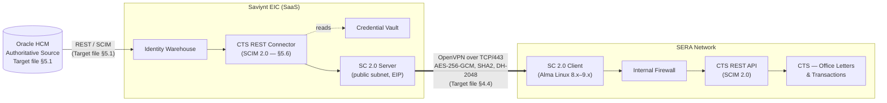

# Saviynt &harr; CTS &mdash; Office Letters &amp; Transactions

**Integration Prerequisites &mdash; aligned to SERA IAM Target Architecture Design V8**

| Item | Value |
| --- | --- |
| Source IGA | Saviynt Enterprise Identity Cloud (EIC) |
| Authoritative identity source | Oracle HCM (Target file &sect;5.1) |
| Target application | CTS &mdash; Office Letters &amp; Transactions (Target file &sect;5.6) |
| Source classification (CTS) | Non-authoritative, Read / Write |
| Connectivity | Saviynt Connect 2.0 (SC 2.0) SSL VPN tunnel (Target file &sect;4) |
| Version | 0.3 |

---

## 1. Introduction

This document lists the prerequisites to integrate **Saviynt EIC** with the **CTS &mdash; Office Letters &amp; Transactions** application, per the SERA IAM Target Architecture Design V8.

Two facts shape every prerequisite below:

1. **Oracle HCM is the authoritative source** for employee identity (Target file &sect;5.1). All employee data sent to CTS originates in Oracle HCM and is projected through Saviynt EIC. CTS receives no direct feed from Oracle HCM.
2. **CTS is a non-authoritative Read / Write target** (Target file &sect;5.6) reached over the SC 2.0 tunnel via the Saviynt REST connector against a SCIM-compliant CTS API.

---

## 2. Connection Architecture (Diagram)



### Flow facts

- **Direction:** strictly Saviynt &rarr; CTS. CTS does not call back into Saviynt.
- **Transport:** end-to-end TLS over the SC 2.0 OpenVPN tunnel.
- **Aggregation:** full import only &mdash; the CTS connector does **not** support incremental import (Target file &sect;5.6.1).
- **HA:** PROD uses 2 SC 2.0 clients (Active + Hot Standby); PreProd uses 1 (Target file &sect;5).

---

## 3. Connection Parameters

Per Target file &sect;5.6, the integration uses the **Saviynt REST connector** against a **SCIM-compliant CTS API**.

### 3.1 Saviynt objects to create

| Object | Field | Value |
| --- | --- | --- |
| Security System | `Systemname` | `CTS` |
| Security System | `Display Name` | `CTS &mdash; Office Letters &amp; Transactions` |
| Security System | `Connection Type` | `REST` |
| Endpoint | `Endpoint Name` | `CTS` |
| Endpoint | `Account Name Rule` &mdash; employees | `${user.systemUserName}` |
| Endpoint | `Account Name Rule` &mdash; contractors | `CTR_${user.firstname}${user.lastname}` |

### 3.2 Authentication

Supported authentication types per Target file &sect;5.6.5, ranked highest to lowest security:

```
mTLS  ›  JWT  ›  OAuth2  ›  OAuth  ›  BasicWithHmac
       ›  SignedHeaders  ›  BasicWithAccessToken  ›  Cookies  ›  Basic
```

- **Recommended:** mTLS (highest security per &sect;5.6.5).
- **Working alternative:** OAuth2 client-credentials.
- **Caveat (&sect;5.6.5):** `BasicWithHmac` is **not** supported for account import with pagination &mdash; only without pagination.

### 3.3 ConnectionJSON &mdash; OAuth2

```json
{
  "authentications": {
    "acctAuth": {
      "authType": "oauth2",
      "url": "https://<cts-host>/oauth2/token",
      "httpMethod": "POST",
      "httpParams": {
        "grant_type": "client_credentials",
        "scope": "scim.read scim.write"
      },
      "httpHeaders": { "Content-Type": "application/x-www-form-urlencoded" },
      "properties": {
        "client_id": "##ENC##<provided by CTS owner>",
        "client_secret": "##ENC##<provided by CTS owner>"
      },
      "expiryDate": "expires_in",
      "authError": ["invalid_token", "invalid_client"],
      "errorPath": "error_description",
      "maxRefreshTryCount": 5,
      "tokenResponsePath": "access_token",
      "accessToken": "Bearer"
    }
  }
}
```

### 3.4 ConnectionJSON &mdash; mTLS (preferred when CTS supports it)

```json
{
  "authentications": {
    "acctAuth": {
      "authType": "mTLS",
      "url": "https://<cts-host>/scim/v2",
      "httpMethod": "GET",
      "httpHeaders": { "Accept": "application/scim+json" },
      "properties": {
        "clientCertificate": "##ENC##<base64 PEM>",
        "clientPrivateKey":  "##ENC##<base64 PEM>",
        "trustStore":        "##ENC##<CTS server CA chain>"
      }
    }
  }
}
```

### 3.5 Mandatory connection parameters (Target file &sect;5.6.5)

| Parameter | Description | Mandatory |
| --- | --- | --- |
| `ConnectionJSON` | Auth type and endpoint definition | Yes |
| `SSL Certificate` | TLS / mTLS certificates loaded into the Saviynt trust store | Yes |
| `statusColumn` | Attribute that determines user status on CTS accounts | Yes |
| `activeStatus` | Values that indicate "active" on CTS accounts; everything else is treated as inactive | Yes |

### 3.6 Network &amp; transport (Target file &sect;4)

| Item | Value |
| --- | --- |
| Connectivity layer | Saviynt Connect 2.0 OpenVPN SSL VPN over TCP/443 |
| SC 2.0 client OS | Alma Linux 8.x &ndash; 9.x (Target file &sect;4.7.2) |
| SC 2.0 client minimum HW | Quad-core 2.3 GHz, 32 GB RAM, 100 GB disk, &ge;512 Mbps NIC (Target file &sect;4.7.1) |
| Crypto | AES-256-GCM, SHA2, DH-2048, key lifetime 28800 s (Target file &sect;4.4) |
| SC 2.0 client outbound | TCP/443 to SC 2.0 server, plus restricted egress to the CTS host only (Target file &sect;4.2) |
| SERA edge allow-list | Saviynt NAT-gateway IP whitelisted at SERA edge (Target file &sect;4.4) |
| HA topology | PROD: 2 SC 2.0 clients (Active + Hot Standby); PreProd: 1 client (Target file &sect;5) |

### 3.7 Required operations (Target file &sect;5.6.4)

| # | Operation | Classification |
| --- | --- | --- |
| 1 | Test Connection | Connection / Validation |
| 2 | Aggregation (full import only &mdash; &sect;5.6.1) | Data Retrieval |
| 3 | Create Account | Provisioning |
| 4 | Enable / Disable Account | Account Management |
| 5 | Add / Remove Entitlement | Access Management |

> **Open item carried over from the Target file:** &sect;5.6.1 lists `Update` and `Delete` for accounts but &sect;5.6.4 omits them. The CTS owner must confirm whether Update Account (PATCH) and Delete Account (DELETE) are in scope.

### 3.8 SCIM v2 endpoints used

| Operation | Method | Path |
| --- | --- | --- |
| Aggregate users | `GET` | `/Users?startIndex=1&count=200` |
| Create user | `POST` | `/Users` |
| Update user | `PATCH` | `/Users/{id}` |
| Enable / Disable | `PATCH` | `/Users/{id}` (toggle `active`) |
| Delete user | `DELETE` | `/Users/{id}` (subject to confirmation) |
| Aggregate entitlements | `GET` | `/Groups?startIndex=1&count=200` |
| Add / Remove entitlement | `PATCH` | `/Groups/{id}` (members `add` / `remove`) |

---

## 4. Attribute Schema

> The Target file &sect;5.6 does not contain a Schema Attributes subsection. The schema below is derived from the universal provisioning attribute mapping in Target file &sect;3.2 plus SCIM 2.0 core, and must be confirmed against the CTS API contract.

### 4.1 Account attribute mapping

| Saviynt EIC user attribute | CTS / SCIM attribute | Saviynt `Accounts` field | Source of truth | Required |
| --- | --- | --- | --- | --- |
| `EmployeeId` | `externalId` | `accountID` correlation | Oracle HCM (`PERSON_NUMBER`, &sect;5.1.5) | Yes |
| `SystemUsername` | `userName` | `name` | AD (`sAMAccountName`, &sect;5.2.7) for employees; Saviynt rule for contractors | Yes |
| `FirstName` | `name.givenName` | `customproperty1` | Oracle HCM | Yes |
| `LastName` | `name.familyName` | `customproperty2` | Oracle HCM | Yes |
| `DisplayName` | `displayName` | `displayName` | Derived (`First Last`) | No |
| `Email` | `emails[type eq "work"].value` | `customproperty3` | AD (&sect;5.2.7) | Yes |
| `DepartmentName` | `urn:...:enterprise:2.0:User.department` | `customproperty4` | Oracle HCM | Yes |
| `Title` | `title` | `customproperty5` | Oracle HCM | Yes |
| `Manager` | `urn:...:enterprise:2.0:User.manager.value` | `customproperty6` | Oracle HCM | Yes |
| `EmployeeType` | `userType` | `customproperty7` | Oracle HCM (employees) / Saviynt (contractors) | Yes |
| `Status` | `active` (boolean) | `status` | Oracle HCM (`ASSIGNMENT_STATUS`) | Yes |

### 4.2 Identity-source mapping (Oracle HCM &rarr; Saviynt EIC)

These Oracle HCM attributes (Target file &sect;5.1.5) feed the EIC user record that is then projected into CTS.

| Oracle HCM attribute | Saviynt EIC user attribute | Use in CTS provisioning |
| --- | --- | --- |
| `PERSON_NUMBER` | `EmployeeId` | `externalId` on CTS |
| `USER_NAME` | Source for `SystemUsername` (final value from AD per &sect;5.2.7) | `userName` on CTS |
| `WORK_EMAIL` | `Email` (validated against AD `mail`) | `emails.work.value` on CTS |
| `WORKER_TYPE` | `EmployeeType` | `userType` on CTS |
| `ASSIGNMENT_STATUS` | `Status` | `active` on CTS |
| `ASSIGNMENT_EFFECTIVE_START_DATE` | Account validity start | Account start date |
| `ASSIGNMENT_EFFECTIVE_END_DATE` / `TERMINATION_DATE` | Account validity end / leaver trigger | Account end date / disable |
| `WORKRELATIONSHIP_PRIMARY_FLAG` / `ASSIGNMENT_PRIMARY_FLAG` | Identifies the primary employment / assignment | Ensures one CTS account per identity |

### 4.3 Sample `ImportAccountEntJSON` (full import)

```json
{
  "accountParams": {
    "connection": "acctAuth",
    "processingType": "SequentialAndIterative",
    "call": {
      "call1": {
        "callOrder": 0,
        "stageNumber": 0,
        "http": {
          "url": "https://<cts-host>/scim/v2/Users?startIndex=1&count=200",
          "httpHeaders": {
            "Authorization": "${access_token}",
            "Accept": "application/scim+json"
          },
          "httpContentType": "application/scim+json",
          "httpMethod": "GET"
        },
        "listField": "Resources",
        "keyField": "accountID",
        "colsToPropsMap": {
          "accountID":       "externalId~#~char",
          "name":            "userName~#~char",
          "displayName":     "displayName~#~char",
          "customproperty1": "name.givenName~#~char",
          "customproperty2": "name.familyName~#~char",
          "customproperty3": "emails[0].value~#~char",
          "customproperty4": "urn:ietf:params:scim:schemas:extension:enterprise:2.0:User.department~#~char",
          "customproperty5": "title~#~char",
          "customproperty6": "urn:ietf:params:scim:schemas:extension:enterprise:2.0:User.manager.value~#~char",
          "customproperty7": "userType~#~char",
          "status":          "active~#~char"
        },
        "statusConfig": { "active": "true", "inactive": "false" },
        "pagination": {
          "page": {
            "nextUrl": "https://<cts-host>/scim/v2/Users?startIndex=${startIndex+200}&count=200",
            "hasMoreField": "totalResults"
          }
        },
        "successResponses": { "statusCode": [200] }
      }
    }
  }
}
```

### 4.4 Entitlement schema

CTS entitlements are imported as **SCIM Groups** under a single working EntitlementType.

| EntitlementType | CTS concept |
| --- | --- |
| `CTS_ROLE` | SCIM Group (CTS application role / group) |

| CTS / SCIM attribute | Saviynt `Entitlement_values` field | Required |
| --- | --- | --- |
| `id` | `entitlement_value` | Yes |
| `displayName` | `displayname` | Yes |
| (constant) `CTS_ROLE` | `entitlement_type` | Yes |
| `meta.description` | `description` | No |

### 4.5 Provisioning payloads

**Create user** &mdash; `POST /scim/v2/Users`

```json
{
  "schemas": [
    "urn:ietf:params:scim:schemas:core:2.0:User",
    "urn:ietf:params:scim:schemas:extension:enterprise:2.0:User"
  ],
  "userName":   "${account.name}",
  "externalId": "${user.employeeid}",
  "name":       { "givenName": "${user.firstname}", "familyName": "${user.lastname}" },
  "displayName":"${user.firstname} ${user.lastname}",
  "emails":     [ { "type": "work", "primary": true, "value": "${user.email}" } ],
  "title":      "${user.title}",
  "userType":   "${user.employeetype}",
  "active":     true,
  "urn:ietf:params:scim:schemas:extension:enterprise:2.0:User": {
    "department": "${user.departmentname}",
    "manager":    { "value": "${user.manager}" }
  }
}
```

**Update user** &mdash; `PATCH /scim/v2/Users/{id}`

```json
{
  "schemas": ["urn:ietf:params:scim:api:messages:2.0:PatchOp"],
  "Operations": [
    { "op": "replace", "path": "title", "value": "${user.title}" },
    { "op": "replace", "path": "urn:ietf:params:scim:schemas:extension:enterprise:2.0:User:department", "value": "${user.departmentname}" },
    { "op": "replace", "path": "urn:ietf:params:scim:schemas:extension:enterprise:2.0:User:manager.value", "value": "${user.manager}" }
  ]
}
```

**Disable user** &mdash; `PATCH /scim/v2/Users/{id}`

```json
{
  "schemas": ["urn:ietf:params:scim:api:messages:2.0:PatchOp"],
  "Operations": [ { "op": "replace", "path": "active", "value": false } ]
}
```

**Assign entitlement (add member to Group)** &mdash; `PATCH /scim/v2/Groups/{groupId}`

```json
{
  "schemas": ["urn:ietf:params:scim:api:messages:2.0:PatchOp"],
  "Operations": [
    { "op": "add", "path": "members", "value": [ { "value": "${account.accountID}" } ] }
  ]
}
```

---

## 5. Highlights on Required Data

### 5.1 Data the CTS / SERA owners must supply before build

| # | Item | Source | Used in |
| --- | --- | --- | --- |
| 1 | CTS base URL per environment (PROD, PreProd) | CTS owner | ConnectionJSON `url` |
| 2 | Authentication artifacts per environment &mdash; client cert + key (mTLS) **or** OAuth2 client_id, client_secret, scopes | CTS owner | ConnectionJSON |
| 3 | Confirmation that the CTS API is **SCIM 2.0 compliant** | CTS owner | Required by Target file &sect;5.6.1 |
| 4 | `statusColumn` and `activeStatus` value list | CTS owner | ConnectionJSON (Target file &sect;5.6.5) |
| 5 | TLS / mTLS certificate chain for the CTS host | CTS owner | Saviynt trust store |
| 6 | SC 2.0 client allow-list to the CTS host (DNS / IP / port) | SERA network team | SC 2.0 client iptables + SERA internal firewall (&sect;4.2) |
| 7 | CTS API contract (SCIM extensions, paging, rate limits) | CTS owner | Connector build |
| 8 | CTS entitlement catalog (SCIM Group ids + display names + descriptions) | CTS owner | EntitlementType `CTS_ROLE` |
| 9 | Confirmation whether **Update Account** (PATCH) is in scope | CTS owner | Resolves &sect;5.6.1 vs &sect;5.6.4 inconsistency |
| 10 | Confirmation whether **Delete Account** (DELETE / hard delete) is in scope | CTS owner | Resolves &sect;5.6.1 vs &sect;5.6.4 inconsistency |
| 11 | Reachability of the CTS host from **both** Active and Hot-Standby SC 2.0 clients in PROD | SERA network team | HA per Target file &sect;4.4 / &sect;5 |

### 5.2 Mandatory user attributes for every CTS account

These attributes must be populated on the Saviynt user before a CTS account can be provisioned.

| Attribute | Source of truth | Why it is required |
| --- | --- | --- |
| `EmployeeId` | Oracle HCM (`PERSON_NUMBER`) | Correlation key &mdash; carried as `externalId` on CTS |
| `FirstName`, `LastName` | Oracle HCM | SCIM `name.givenName` / `name.familyName` |
| `Email` | AD (Target file &sect;5.2.7) | SCIM `emails.work.value` |
| `SystemUsername` | AD (`sAMAccountName`, Target file &sect;5.2.7) | SCIM `userName` |
| `DepartmentName` | Oracle HCM | SCIM enterprise `department` |
| `Title` | Oracle HCM | SCIM `title` |
| `Manager` | Oracle HCM | SCIM enterprise `manager` |
| `EmployeeType` | Oracle HCM (employees) / Saviynt (contractors) | SCIM `userType` |
| `Status` | Oracle HCM (`ASSIGNMENT_STATUS`) | SCIM `active` |

### 5.3 Mandatory entitlement metadata

For each entitlement the CTS owner publishes:

- Stable `id` (SCIM Group id), not a localized name.
- `displayName` and `description`.
- Owner (for approval routing).
- Risk tag (`Low` / `Medium` / `High`).

### 5.4 Aggregation constraint

CTS connector supports **full import only** (Target file &sect;5.6.1). Schedule a daily full import for both `/Users` and `/Groups`. Incremental import is not available.

---

## Appendix A &mdash; Cross-reference to SERA Target Architecture Design V8

| Section in this document | Target file section(s) |
| --- | --- |
| 1. Introduction | &sect;5.1, &sect;5.6 |
| 2. Connection Architecture | &sect;4 (SC 2.0), &sect;5.6.3 |
| 3. Connection Parameters | &sect;5.6.4, &sect;5.6.5, &sect;4.4, &sect;4.7 |
| 4. Attribute Schema | &sect;3.2, &sect;5.1.5, &sect;5.6.1 |
| 5. Highlights on Required Data | &sect;5.6.1, &sect;5.6.5, &sect;4 |
