# Saviynt &harr; CTS &mdash; Office Letters &amp; Transactions

**Integration Design Document &mdash; aligned to SERA IAM Target Architecture Design V8**

| Item | Value |
| --- | --- |
| Source IGA | Saviynt Enterprise Identity Cloud (EIC) |
| Authoritative Identity Source | **Oracle HCM** (per SERA Target Architecture &sect;5.1) |
| Target Application | **CTS &mdash; Office Letters &amp; Transactions (OL&amp;T)** (per SERA Target Architecture &sect;5.6) |
| Source classification (CTS) | Non-authoritative, Read / Write |
| Connectivity | Saviynt Connect 2.0 (SC 2.0) SSL VPN tunnel (per SERA Target Architecture &sect;4) |
| Document Owner | Secure Networks &mdash; Identity Security Practice |
| Status | Draft &mdash; aligned to Target Architecture V8 |
| Version | 0.2 |

> **Sourcing.** Every statement in this document is anchored either in the SERA IAM Target Architecture Design V8 (cited inline as "Target file &sect;X.Y") or is explicitly flagged as a working assumption / open item that must be confirmed with the SERA / CTS application owners. Items not addressed by the Target file are tagged `[gap in Target file]` so they can be tracked.

---

## 1. Introduction

### 1.1 Purpose

This document is laser-focused on the integration between **Saviynt EIC** and the **CTS &mdash; Office Letters &amp; Transactions (OL&amp;T)** application at SERA. It describes the connection topology, the data exchanged, and the operational behavior of the integration. It is the working contract between:

- **Solution architects** validating the connection topology and authentication choices.
- **Saviynt engineers** building and operating the CTS connector.
- **CTS application owners** approving the data being read from and written into CTS.
- **Information Security and Audit** reviewing the controls around credentials, transport, and reconciliation.

Two facts shape every section that follows:

1. **Oracle HCM is the authoritative source** for employee identity at SERA (Target file &sect;2 and &sect;5.1). All employee identity data that lands in CTS originates in Oracle HCM and flows through Saviynt EIC; CTS does **not** receive any identity feed directly from Oracle HCM.
2. **CTS is a non-authoritative Read / Write target** (Target file &sect;2). Saviynt is the only system permitted to mutate CTS accounts and entitlements at scale.

### 1.2 Scope

In scope:

- Account lifecycle for CTS users (create, update, enable, disable, delete) for both employees (sourced from Oracle HCM) and contractors (sourced from ITSM into Saviynt &mdash; Target file &sect;3.2).
- Entitlement (role / group / permission) import (aggregation) and provisioning (add / remove) from Saviynt to CTS.
- Periodic full reconciliation (incremental import is **not** supported per Target file &sect;5.6.1) of accounts and entitlements into Saviynt.
- Birthright and request-based access flows for CTS originated from Saviynt.
- ServiceDesk-originated CTS account / entitlement requests via the Saviynt EIC API (Target file &sect;6).

Out of scope:

- Business-process changes inside CTS (letter templates, transaction approval workflows).
- Federation / SSO between CTS and the corporate IdP &mdash; covered by the SERA SSO design and only referenced here.
- Migration of legacy CTS local accounts that have no Oracle HCM correlation &mdash; handled as a one-time cleanup before go-live.

### 1.3 Business context

CTS is the SERA module that office users rely on to (a) generate customer-facing **Letters** and (b) post operational **Transactions**. Because both data domains are sensitive, access to CTS must follow the SERA standard joiner / mover / leaver flows defined in the Target file:

- Automated employee account provisioning from Oracle HCM (Target file &sect;3.1).
- Automated contractor account provisioning from ITSM into Saviynt (Target file &sect;3.2).
- Mover updates triggered by Oracle HCM attribute changes (Target file &sect;3.3).
- Leaver suspension and time-bound deletion (Target file &sect;3.4).
- Access requests, certifications, password management, and RBAC (Target file &sect;3.5).

### 1.4 Definitions

| Term | Meaning |
| --- | --- |
| EIC | Saviynt Enterprise Identity Cloud |
| SC 2.0 | Saviynt Connect 2.0 &mdash; the SSL VPN tunnel between Saviynt SaaS and the SERA network (Target file &sect;4) |
| Authoritative source | The system of record for identity data &mdash; **Oracle HCM** for SERA employees |
| Target | A non-authoritative application managed by Saviynt &mdash; **CTS** in this document |
| Endpoint (Saviynt) | The CTS endpoint object inside Saviynt |
| Security System (Saviynt) | The Saviynt parent object that holds the connection to CTS |
| ConnectionJSON | Saviynt JSON block describing how to authenticate / call CTS |
| ImportAccountEntJSON | Saviynt JSON block describing how to read accounts / entitlements from CTS |
| OL&amp;T | Office Letters &amp; Transactions, the CTS module being onboarded |

---

## 2. Connection Architecture (Diagram)

The integration is a chain: **Oracle HCM &rarr; Saviynt EIC &rarr; SC 2.0 tunnel &rarr; CTS**. Saviynt is always the initiator of the call into CTS; CTS does not call back into Saviynt. The SC 2.0 tunnel terminates inside the SERA network and from there reaches CTS over the SERA LAN.

```mermaid
flowchart LR
    subgraph AUTH["Authoritative source (Target file §5.1)"]
        HCM[("Oracle HCM<br/>REST / SCIM<br/>Authoritative Source")]
    end

    subgraph ITSM_SRC["Contractor source (Target file §3.2)"]
        ITSM["ITSM<br/>(Contractor onboarding)"]
    end

    subgraph SAVIYNT["Saviynt EIC (SaaS)"]
        direction TB
        IMPORT["HCM REST Connector<br/>(Full import — §5.1.1)"]
        IDENT["Identity Warehouse<br/>(Users, Lifecycle Rules)"]
        WF["Access Request &<br/>Workflow / SoD Engine"]
        CTS_CONN["CTS REST Connector<br/>(REST / SCIM — §5.6)"]
        VAULT["Credential Vault"]
        SC2_SRV["SC 2.0 Server<br/>(public subnet, EIP)"]
        IMPORT --> IDENT --> WF --> CTS_CONN
        CTS_CONN -. reads .-> VAULT
        CTS_CONN --> SC2_SRV
    end

    subgraph SERA["SERA Network"]
        direction TB
        SC2_CLI["SC 2.0 Client<br/>(Alma Linux 8/9, tun0)"]
        FW["Internal Firewall"]
        CTS_API["CTS REST API<br/>(SCIM-compliant)"]
        CTS_APP["CTS — Office Letters<br/>& Transactions"]
        SC2_CLI --> FW --> CTS_API --> CTS_APP
    end

    HCM -- "REST / SCIM<br/>(Full import — Target file §5.1.1)" --> IMPORT
    ITSM -- "API push or DB import<br/>(Target file §3.2)" --> IDENT

    SC2_SRV == "OpenVPN over TCP/443<br/>AES-256-GCM, SHA2, DH-2048<br/>(Target file §4.4)" ==> SC2_CLI
```



### 2.1 Flow notes

1. **Identity flow (read, authoritative):** Oracle HCM &rarr; Saviynt EIC via the Saviynt HCM REST connector. Full imports only (Target file &sect;5.1.1). All CTS account creates are driven by attributes that Saviynt has previously imported from Oracle HCM.
2. **Contractor flow:** ITSM publishes contractor records into Saviynt either via the EIC API or via a DB import job (Target file &sect;3.2). Contractors do not flow through Oracle HCM. CTS account creation for contractors uses naming convention `CTR_<first><last>` per Target file &sect;3.2.
3. **Provisioning flow (write):** Saviynt EIC &rarr; SC 2.0 Server &rarr; SC 2.0 Client &rarr; CTS REST API. All create / update / enable / disable / delete and entitlement assignment calls go through the CTS REST API.
4. **Aggregation flow (read):** Same path as provisioning, in the opposite direction. Used for account and entitlement aggregation. **Incremental import is not supported by the CTS connector** (Target file &sect;5.6.1) &mdash; only full imports are scheduled.
5. **Direction:** Strictly Saviynt &rarr; CTS for all writes. There is no inbound traffic from CTS to Saviynt.
6. **Transport:** End-to-end TLS over the SC 2.0 OpenVPN tunnel (AES-256-GCM, SHA2, DH-2048, key lifetime 28800s &mdash; Target file &sect;4.4). The CTS REST endpoint itself must additionally be TLS-protected.
7. **High availability:** PROD uses **two SC 2.0 clients** (Active + Hot Standby) per Target file &sect;4.4 / &sect;5; PreProd uses **one** SC 2.0 client. CTS must be reachable from both clients.
8. **Credentials:** Stored in the Saviynt vault and never inlined in clear text in connector JSON (referenced via `##ENC##`).

---

## 3. Connection Parameters

Per Target file &sect;5.6, the CTS integration uses the **Saviynt REST connector** and the SCIM-compliant CTS REST API.

> **Note (Target file &sect;5.6.1):** "The REST connector supports only standard SCIM APIs and standard responses." The CTS API exposed to Saviynt **must** be SCIM 2.0 compliant or wrapped behind a SCIM-compliant gateway.

### 3.1 Security System &amp; Endpoint

| Saviynt object | Field | Value |
| --- | --- | --- |
| Security System | `Systemname` | `CTS` |
| Security System | `Display Name` | `CTS &mdash; Office Letters &amp; Transactions` |
| Security System | `Connection Type` | `REST` |
| Security System | `Provisioning Connection` | `CTS_REST` |
| Security System | `Service Desk Connection` | Per SERA ServiceDesk integration (Target file &sect;6) |
| Endpoint | `Endpoint Name` | `CTS` |
| Endpoint | `Display Name` | `CTS &mdash; Office Letters &amp; Transactions` |
| Endpoint | `Account Name Rule` &mdash; employees | `${user.systemUserName}` (sourced from AD per Target file &sect;5.2.7) |
| Endpoint | `Account Name Rule` &mdash; contractors | `CTR_${user.firstname}${user.lastname}` (Target file &sect;3.2 step 4) |
| Endpoint | `Status Config` | Mapped via `statusColumn` / `activeStatus` (Target file &sect;5.6.5) |

### 3.2 Authentication &mdash; supported types (Target file &sect;5.6.5)

The Target file lists the supported authentication types from highest to lowest security. The recommended choice is the topmost type that the CTS API can serve.

| Rank | Auth type | Notes |
| --- | --- | --- |
| 1 | **mTLS** | Recommended where CTS can present and validate client certificates. The Target file flags this as the highest-security option for the REST connector. |
| 2 | JWT | Suitable when CTS supports JWT bearer tokens with rotated signing keys. |
| 3 | OAuth2 | Standard option when CTS exposes a token endpoint; client-credentials grant assumed for system-to-system. |
| 4 | OAuth | Legacy OAuth 1.0a flows. |
| 5 | BasicWithHmac | **Caveat (Target file &sect;5.6.5):** "Not supported for account import with pagination. Supported only for account import without pagination." Use only if the CTS dataset is small enough to import without paging. |
| 6 | SignedHeaders | |
| 7 | BasicWithAccessToken | |
| 8 | Cookies | |
| 9 | Basic | Lowest security &mdash; not recommended for PROD. |

**Working selection:** OAuth2 client-credentials for PROD (and mTLS if CTS supports it). Confirm with CTS owner. `[gap in Target file]` &mdash; the V8 Target file does not pin a single auth choice for CTS.

### 3.3 ConnectionJSON &mdash; OAuth2 example

```json
{
  "authentications": {
    "acctAuth": {
      "authType": "oauth2",
      "url": "https://<cts-host>/oauth2/token",
      "httpMethod": "POST",
      "httpParams": {
        "grant_type": "client_credentials",
        "scope": "scim.read scim.write"
      },
      "httpHeaders": {
        "Content-Type": "application/x-www-form-urlencoded"
      },
      "properties": {
        "client_id": "##ENC##<provided by CTS owner>",
        "client_secret": "##ENC##<provided by CTS owner>"
      },
      "expiryDate": "expires_in",
      "authError": ["invalid_token", "invalid_client"],
      "timeOutError": "Read timed out",
      "errorPath": "error_description",
      "maxRefreshTryCount": 5,
      "tokenResponsePath": "access_token",
      "accessToken": "Bearer"
    }
  }
}
```

### 3.4 ConnectionJSON &mdash; mTLS variant (preferred when supported by CTS)

```json
{
  "authentications": {
    "acctAuth": {
      "authType": "mTLS",
      "url": "https://<cts-host>/scim/v2",
      "httpMethod": "GET",
      "httpHeaders": { "Accept": "application/scim+json" },
      "properties": {
        "clientCertificate": "##ENC##<base64 PEM>",
        "clientPrivateKey":  "##ENC##<base64 PEM>",
        "trustStore":        "##ENC##<CTS server CA chain>"
      }
    }
  }
}
```

### 3.5 Mandatory connection parameters (Target file &sect;5.6.5)

| Parameter | Description (Target file &sect;5.6.5) | Mandatory? |
| --- | --- | --- |
| `ConnectionJSON` | JSON describing the auth type and endpoint &mdash; see &sect;3.3 / &sect;3.4 above | **Yes** |
| `SSL Certificate` | SSL / mTLS certificates stored in the Saviynt trust store, used to encrypt traffic to CTS | **Yes** |
| `statusColumn` | Attribute that determines user status on CTS accounts | **Yes** |
| `activeStatus` | List of values that indicate "active" on CTS accounts; everything else is treated as inactive | **Yes** |

Working values:

```text
Host URL      = https://<cts-host>/scim/v2     ← confirm with CTS owner
statusColumn  = active
activeStatus  = true,Active,A                  ← confirm with CTS owner
```

### 3.6 HTTP envelope (working defaults &mdash; tune per CTS owner)

| Parameter | Value | Notes |
| --- | --- | --- |
| Base URL | `https://<cts-host>/scim/v2` | SCIM v2 root, per Target file &sect;5.6.1 SCIM constraint |
| Auth header | `Authorization: Bearer <access_token>` (OAuth2) or mTLS handshake | Injected from `acctAuth` |
| Content type | `application/scim+json` | SCIM standard |
| Connect timeout | `30s` | Saviynt default |
| Read timeout | `60s` | Long enough for paged user reads |
| Retry policy | 3 retries, 5s back-off, on `5xx` and `429` | Idempotent requests only |
| Pagination | SCIM `?startIndex=<n>&count=<page_size>` | Required because incremental import is not supported (full import only) &mdash; Target file &sect;5.6.1 |
| Rate limit | Honor `Retry-After` | `[gap in Target file]` &mdash; confirm CTS rate-limit policy |

### 3.7 Network &amp; security parameters (Target file &sect;4)

| Item | Value |
| --- | --- |
| Connectivity layer | **Saviynt Connect 2.0 (SC 2.0)** OpenVPN SSL VPN tunnel over TCP/443 |
| SC 2.0 client OS | **Alma Linux 8.x &ndash; 9.x** (per Target file &sect;4.7.2 SERA-specific list) |
| SC 2.0 client min HW | Quad-core 2.3 GHz, 32 GB RAM, 100 GB disk, &ge; 512 Mbps NIC (Target file &sect;4.7.1) |
| Encryption | AES-256-GCM (Target file &sect;4.4) |
| Authentication algo | SHA2; HMAC tls-auth (Target file &sect;4.4) |
| Key size / lifetime | DH-2048 / 28800 s (Target file &sect;4.4) |
| Source IPs (Saviynt &rarr; SERA) | NAT-gateway IP allow-listed at SERA edge (Target file &sect;4.4) |
| Outbound on SC 2.0 client | TCP/443 to SC 2.0 server, plus restricted egress to CTS only (Target file &sect;4.2) |
| HA topology | PROD: 2 SC 2.0 clients (Active + Hot-Standby); PreProd: 1 client (Target file &sect;5 intro) |
| TLS to CTS | TLS 1.2+ end-to-end; cert chain trusted by Saviynt trust store |
| Credential storage | Saviynt vault; referenced via `##ENC##` in connector JSON |
| Credential rotation | Every 90 days, jointly orchestrated with the CTS owner &mdash; *recommendation* |

### 3.8 Required operations (Target file &sect;5.6.4)

| # | Operation | Description (Target file &sect;5.6.4) | Classification |
| --- | --- | --- | --- |
| 1 | **Test Connection** | Connectivity test to validate API credentials, URL, and auth parameters | Connection / Validation |
| 2 | **Aggregation** | Retrieves accounts, groups, and entitlements from CTS into Saviynt for inventory and governance (full import only &mdash; Target file &sect;5.6.1) | Data Retrieval / Import |
| 3 | **Create Account** | Creates a CTS user account from Saviynt identity data | Provisioning |
| 4 | **Enable / Disable Account** | Activates or deactivates a CTS user account as part of lifecycle management | Account Management |
| 5 | **Add / Remove Entitlement** | Grants or revokes entitlements (roles, groups, permissions) on a CTS user | Access Management |

> **Inconsistency carried over from the Target file (&sect;5.6.1 vs &sect;5.6.4):** Supported features list "Support for creating, updating, deleting, enabling, and disabling accounts" but the Required Operations table omits *Update Account* and *Delete Account*. Working assumption is that both **Update Account** (PATCH) and **Delete Account** (DELETE) **are** in scope &mdash; to be confirmed with the CTS owner before sign-off.

### 3.9 SCIM endpoints used (working set)

| Operation | Method | Path (SCIM v2) | Notes |
| --- | --- | --- | --- |
| Aggregate users | `GET` | `/Users?startIndex=1&count=200` | Full import; paged |
| Get user | `GET` | `/Users/{id}` | Single-user refresh |
| Create user | `POST` | `/Users` | SCIM core schema body |
| Update user | `PATCH` | `/Users/{id}` | Operations array (replace / add / remove) |
| Enable / Disable | `PATCH` | `/Users/{id}` | Toggle `active` attribute |
| Delete user | `DELETE` | `/Users/{id}` | Use only if Target file allows hard delete |
| Aggregate entitlements | `GET` | `/Groups?startIndex=1&count=200` | Roles / groups represented as SCIM Groups |
| Add entitlement | `PATCH` | `/Groups/{id}` | Op = `add`, path = `members` |
| Remove entitlement | `PATCH` | `/Groups/{id}` | Op = `remove`, path = `members[value eq "{userId}"]` |

---

## 4. Attribute Schema

> **Important caveat.** Section 5.6 of the Target file (CTS) **does not contain a `Schema Attributes` subsection**, even though the comparable target sections do (Oracle Fusion &sect;5.4.5, Dynamics 365 CRM &sect;5.5.5, CyberArk &sect;5.7.5). The schema below is **derived** from the SERA-wide provisioning attribute mapping in Target file &sect;3.2 plus the SCIM 2.0 core User schema, and is offered as the working schema until the CTS owner confirms the actual CTS attribute names. Items derived this way are tagged `[derived]`. `[gap in Target file]`

### 4.1 Account attribute mapping (CTS &harr; Saviynt `Accounts`)

The "EIC User Attribute" column reflects Target file &sect;3.2's provisioning attribute mapping. The "Source of truth" column makes the upstream chain explicit.

| EIC User Attribute (Target file &sect;3.2) | CTS attribute (SCIM core / `[derived]`) | Saviynt `Accounts` field | Source of truth | Required | Direction |
| --- | --- | --- | --- | --- | --- |
| `EmployeeId` | `externalId` | `accountID` correlation | **Oracle HCM** &rarr; `PERSON_NUMBER` (&sect;5.1.5) | **Yes** | EIC &rarr; CTS |
| `SystemUsername` | `userName` | `name` | AD authoritative for `sAMAccountName` (Target file &sect;5.2.7) | **Yes** | EIC &rarr; CTS (employees), Saviynt rule (contractors) |
| `FirstName` | `name.givenName` | `customproperty1` | Oracle HCM | **Yes** | EIC &rarr; CTS |
| `LastName` | `name.familyName` | `customproperty2` | Oracle HCM | **Yes** | EIC &rarr; CTS |
| `DisplayName` | `displayName` | `displayName` | Derived (`First Last`) | No | EIC &rarr; CTS |
| `Email` | `emails[type eq "work"].value` | `customproperty3` | AD (Target file &sect;5.2.7) | **Yes** | EIC &rarr; CTS |
| `DepartmentName` | `department` (enterprise ext.) | `customproperty4` | Oracle HCM | **Yes** | Both |
| `Title` / `Job Code` | `title` | `customproperty5` | Oracle HCM | **Yes** | Both |
| `Manager` | `manager.value` (enterprise ext.) | `customproperty6` | Oracle HCM | **Yes** | Both |
| `EmployeeType` | `userType` | `customproperty7` | Oracle HCM (employees), Saviynt (contractors) | **Yes** | EIC &rarr; CTS |
| `City` / `Location` | `addresses[type eq "work"].locality` | `customproperty8` | Oracle HCM | No | Both |
| `Phone Number` | `phoneNumbers[type eq "work"].value` | `customproperty9` | Oracle HCM / AD | No | EIC &rarr; CTS |
| `Start Date` | `[derived]` extension | `customproperty10` | Oracle HCM (`ASSIGNMENT_EFFECTIVE_START_DATE`) | No | EIC &rarr; CTS |
| `End Date` | `[derived]` extension | `customproperty11` | Oracle HCM (`ASSIGNMENT_EFFECTIVE_END_DATE` / `TERMINATION_DATE`) | No | EIC &rarr; CTS |
| `Status` | `active` (boolean) | `status` | Oracle HCM (`ASSIGNMENT_STATUS`) | **Yes** | Both, mapped via `statusColumn` / `activeStatus` |

### 4.2 Identity-source mapping (Oracle HCM &rarr; Saviynt user profile)

This is the upstream half of the chain &mdash; how Oracle HCM populates the EIC user record that is then projected into CTS.

| Oracle HCM attribute (Target file &sect;5.1.5) | Saviynt EIC User Profile attribute | Use in CTS provisioning |
| --- | --- | --- |
| `PERSON_NUMBER` | `EmployeeId` (correlation key) | `externalId` on CTS |
| `USER_NAME` | Used to derive `SystemUsername` (final value comes from AD per &sect;5.2.7) | `userName` on CTS |
| `WORK_EMAIL` | `Email` (validated against AD `mail`) | `emails.work.value` on CTS |
| `WORKER_TYPE` | `EmployeeType` | `userType` on CTS |
| `ASSIGNMENT_STATUS` | `Status` | `active` on CTS |
| `ASSIGNMENT_ACTION_CODE` (e.g. `HIRE`) | Drives joiner workflow trigger | n/a (orchestration only) |
| `ASSIGNMENT_EFFECTIVE_START_DATE` | `Start Date` | Account validity start |
| `ASSIGNMENT_EFFECTIVE_END_DATE` | `End Date` | Account validity end |
| `TERMINATION_DATE` | Drives leaver workflow trigger | Triggers Suspend &rarr; Cleanup &rarr; Delete sequence (&sect;3.4) |
| `WORKRELATIONSHIP_PRIMARY_FLAG` | Used to identify the primary employment record | Ensures only one CTS account per identity |
| `ASSIGNMENT_PRIMARY_FLAG` | Used to identify the primary assignment | Same as above |
| `PERIOD_OF_SERVICE_ID` | Stored as a custom attribute | Audit / re-hire correlation |

### 4.3 Sample `ImportAccountEntJSON` (REST / SCIM, full import)

```json
{
  "accountParams": {
    "connection": "acctAuth",
    "processingType": "SequentialAndIterative",
    "call": {
      "call1": {
        "callOrder": 0,
        "stageNumber": 0,
        "http": {
          "url": "https://<cts-host>/scim/v2/Users?startIndex=1&count=200",
          "httpHeaders": {
            "Authorization": "${access_token}",
            "Accept": "application/scim+json"
          },
          "httpContentType": "application/scim+json",
          "httpMethod": "GET"
        },
        "listField": "Resources",
        "keyField": "accountID",
        "colsToPropsMap": {
          "accountID":       "externalId~#~char",
          "name":            "userName~#~char",
          "displayName":     "displayName~#~char",
          "customproperty1": "name.givenName~#~char",
          "customproperty2": "name.familyName~#~char",
          "customproperty3": "emails[0].value~#~char",
          "customproperty4": "urn:ietf:params:scim:schemas:extension:enterprise:2.0:User.department~#~char",
          "customproperty5": "title~#~char",
          "customproperty6": "urn:ietf:params:scim:schemas:extension:enterprise:2.0:User.manager.value~#~char",
          "customproperty7": "userType~#~char",
          "status":          "active~#~char"
        },
        "statusConfig": {
          "active":   "true",
          "inactive": "false"
        },
        "pagination": {
          "page": {
            "nextUrl": "https://<cts-host>/scim/v2/Users?startIndex=${startIndex+200}&count=200",
            "hasMoreField": "totalResults"
          }
        },
        "successResponses": { "statusCode": [200] }
      }
    }
  }
}
```

### 4.4 Entitlement schema

The Target file &sect;5.6.1 lists `Entitlements` as a supported object class for CTS but does not enumerate the entitlement types. Working assumption: entitlements are exposed as **SCIM Groups** and imported as a single Saviynt EntitlementType called `CTS_ROLE`. Additional EntitlementTypes can be added once the CTS owner confirms the catalog. `[gap in Target file]`

| EntitlementType in Saviynt | CTS concept | Description |
| --- | --- | --- |
| `CTS_ROLE` (working) | SCIM Group | Application role / group on CTS |

### 4.5 Entitlement attribute mapping

| CTS / SCIM attribute | Saviynt `Entitlement_values` attribute | Required | Notes |
| --- | --- | --- | --- |
| `id` | `entitlement_value` | **Yes** | SCIM Group id; unique within EntitlementType |
| `displayName` | `displayname` | **Yes** | Human-readable |
| (constant) `CTS_ROLE` | `entitlement_type` | **Yes** | Working single type until CTS catalog is confirmed |
| `meta.description` | `description` | No | |
| `[derived]` risk tag | `risk` | No | Mapped to Saviynt risk weight 1&ndash;10 |

### 4.6 Account &harr; Entitlement relationship

| CTS / SCIM attribute | Saviynt `Account_Entitlements1` attribute | Notes |
| --- | --- | --- |
| `members[*].value` (on Group) | `accountID` | FK to account |
| `id` (Group) | `entitlement_valuekey` | FK to entitlement value |
| `[derived]` `assignedOn` | `customproperty1` | Audit |
| `[derived]` `expiresOn` | `validuntil` | Drives time-bound access |

### 4.7 Provisioning payloads (Saviynt &rarr; CTS)

**Create user** &mdash; `POST /scim/v2/Users`

```json
{
  "schemas": [
    "urn:ietf:params:scim:schemas:core:2.0:User",
    "urn:ietf:params:scim:schemas:extension:enterprise:2.0:User"
  ],
  "userName":   "${account.name}",
  "externalId": "${user.employeeid}",
  "name": {
    "givenName":  "${user.firstname}",
    "familyName": "${user.lastname}"
  },
  "displayName": "${user.firstname} ${user.lastname}",
  "emails": [
    { "type": "work", "primary": true, "value": "${user.email}" }
  ],
  "title":    "${user.title}",
  "userType": "${user.employeetype}",
  "active":   true,
  "urn:ietf:params:scim:schemas:extension:enterprise:2.0:User": {
    "department": "${user.departmentname}",
    "manager":    { "value": "${user.manager}" }
  }
}
```

**Update user** &mdash; `PATCH /scim/v2/Users/{id}`

```json
{
  "schemas": ["urn:ietf:params:scim:api:messages:2.0:PatchOp"],
  "Operations": [
    { "op": "replace", "path": "title",    "value": "${user.title}" },
    { "op": "replace", "path": "urn:ietf:params:scim:schemas:extension:enterprise:2.0:User:department", "value": "${user.departmentname}" },
    { "op": "replace", "path": "urn:ietf:params:scim:schemas:extension:enterprise:2.0:User:manager.value", "value": "${user.manager}" }
  ]
}
```

**Disable user** &mdash; `PATCH /scim/v2/Users/{id}`

```json
{
  "schemas": ["urn:ietf:params:scim:api:messages:2.0:PatchOp"],
  "Operations": [ { "op": "replace", "path": "active", "value": false } ]
}
```

**Assign entitlement (add member to Group)** &mdash; `PATCH /scim/v2/Groups/{groupId}`

```json
{
  "schemas": ["urn:ietf:params:scim:api:messages:2.0:PatchOp"],
  "Operations": [
    { "op": "add", "path": "members", "value": [ { "value": "${account.accountID}" } ] }
  ]
}
```

### 4.8 ServiceDesk-originated requests (Target file &sect;6)

CTS account / entitlement requests raised through the ServiceDesk channel use the EIC API documented in Target file &sect;6.

- **Create new CTS account:** `POST {{url}}/ECM/{{path}}/createrequest` with `requesttype = NEW`, `endpoint = "CTS"`, `securitysystem = "CTS"` (Target file &sect;6.1).
- **Add roles to a CTS user:** `POST {{url}}/ECM/{{path}}/createrequest` with `accesstype = ROLES`, `roletype = ENTERPRISE` (Target file &sect;6.2).
- **Add entitlement to a CTS user:** `POST {{url}}/ECM/{{path}}/createrequest` with `requesttype = ADD`, `endpoint = "CTS"`, `entitlement[*].entitlementtype = "CTS_ROLE"` (or whatever final type the CTS owner publishes) and `entitlement[*].entitlementvalue` set to the CTS group id (Target file &sect;6.3).

All three calls require `Authorization: Bearer <token>` and `Content-Type: application/json` exactly as specified in Target file &sect;6.

---

## 5. Highlights on Required Data

The integration cannot go live until the items below are confirmed and in place. Each item has a source, a use, and an acceptance check. Where the Target file is silent, the item is tagged `[gap in Target file]`.

### 5.1 Mandatory data the CTS / SERA owners must supply

| # | Data item | Source | Used in | Why it is mandatory |
| --- | --- | --- | --- | --- |
| 1 | CTS base URL per environment (PROD, PreProd) | CTS owner | ConnectionJSON `url` | No connector can be built without it. `[gap in Target file]` |
| 2 | Authentication artifacts per environment &mdash; client cert + key (mTLS) **or** OAuth2 client_id + secret + scopes | CTS owner | ConnectionJSON | Per Target file &sect;5.6.5 |
| 3 | SCIM compliance confirmation | CTS owner | Connector design | The Saviynt REST connector requires standard SCIM APIs and responses (Target file &sect;5.6.1) |
| 4 | `statusColumn` and `activeStatus` value list for CTS accounts | CTS owner | ConnectionJSON | Mandatory parameter (Target file &sect;5.6.5) |
| 5 | TLS / mTLS certificate chain for the CTS host | CTS owner | Saviynt trust store (Target file &sect;5.6.5) | Required for transport security |
| 6 | SC 2.0 client allow-list to the CTS host (IP / port / DNS name) | SERA network team | SC 2.0 client iptables and SERA internal firewall (Target file &sect;4.2) | Without it, the SC 2.0 tunnel cannot reach CTS |
| 7 | CTS API contract (SCIM extensions, paging style, rate limits) | CTS owner | Connector build &amp; payload mapping | Confirms SCIM extensions and paging shape |
| 8 | CTS entitlement catalog (SCIM Group ids + display names + descriptions + risk tags) | CTS owner | EntitlementType `CTS_ROLE` content (&sect;4.4) | Required for governance, requests, and certifications. `[gap in Target file]` |
| 9 | Whether **hard delete** of CTS accounts is permitted, or disable-only | CTS owner | Lifecycle (&sect;3.8) | The Target file is inconsistent (&sect;5.6.1 vs &sect;5.6.4) on whether Delete is in scope |
| 10 | Whether **Update Account** (PATCH) is in scope | CTS owner | Lifecycle (&sect;3.8) | Same Target file inconsistency &mdash; Update is in &sect;5.6.1 but missing from &sect;5.6.4 |

### 5.2 Mandatory user attributes for every CTS account

These attributes **must** be populated on the Saviynt user before a CTS account can be provisioned. They are a strict subset of the Target file &sect;3.2 mapping, anchored on Oracle HCM as the authoritative source.

| Attribute | Source of truth | Why it is required for CTS |
| --- | --- | --- |
| `EmployeeId` | **Oracle HCM** (`PERSON_NUMBER`) | Correlation key &mdash; carried as `externalId` on CTS, used for lifecycle linkage |
| `FirstName`, `LastName` | **Oracle HCM** | SCIM `name.givenName` / `name.familyName`; used on letters and transaction logs |
| `Email` | AD (Target file &sect;5.2.7) | SCIM `emails.work.value`; CTS notifications |
| `SystemUsername` | AD (`sAMAccountName`, Target file &sect;5.2.7) | SCIM `userName`; account login |
| `DepartmentName` | **Oracle HCM** | SCIM enterprise `department`; drives queue / template visibility |
| `Title` | **Oracle HCM** | SCIM `title`; supports RBAC and certifications |
| `Manager` | **Oracle HCM** | SCIM enterprise `manager`; required for the request and certification approver path (Target file &sect;3.5) |
| `EmployeeType` | Oracle HCM (employees) / Saviynt (contractors) | SCIM `userType`; distinguishes employees from contractors and drives policy |
| `Status` | Oracle HCM (`ASSIGNMENT_STATUS`) | SCIM `active`; joiner / leaver gating |

### 5.3 Mandatory entitlement metadata

For every entitlement the CTS owner publishes, the following metadata **must** be present so Saviynt can govern it:

- A stable `id` (SCIM Group id), not a localized name.
- A clear `displayName` and `description` &mdash; surfaced in the request catalog and in certifications (Target file &sect;3.5).
- A risk tag (working values: `Low`, `Medium`, `High`).
- An owner (for approval routing).
- Any business-context tag (e.g., branch / cost center scope) needed for scoped access.

### 5.4 Lifecycle behavior summary (per Target file &sect;3.1 &ndash; &sect;3.4)

| Event | Trigger | CTS action | Saviynt configuration |
| --- | --- | --- | --- |
| Joiner &mdash; employee | Oracle HCM new-hire (&sect;3.1) | Create CTS account, apply birthright entitlements | Birthright Rules + Account Name Generation Rules |
| Joiner &mdash; contractor | ITSM contractor record &rarr; Saviynt (&sect;3.2) | Create CTS account named `CTR_<first><last>`, apply birthright entitlements | Saviynt internal source + Birthright Rules |
| Mover | Oracle HCM change to Manager / Department / Title / Location / EmployeeType (&sect;3.3) | Update CTS account attributes; re-evaluate entitlements | Update Account Task on the CTS endpoint |
| Leaver &mdash; suspend | Oracle HCM termination (&sect;3.4 step 1&ndash;2) | Disable CTS account immediately | Default action `SUSPEND` |
| Leaver &mdash; cleanup | Configurable grace period (e.g., 3 days) (&sect;3.4 step 3) | Revoke high-value entitlements / licenses | Post-Termination Cleanup Rules |
| Leaver &mdash; delete | Retention period elapsed (e.g., 180 days) (&sect;3.4 step 4) | Hard delete CTS account (subject to item 9 in &sect;5.1) | User Update Rule + Deprovision Access |

### 5.5 Reconciliation &amp; data-quality SLAs

| Item | Target | Source |
| --- | --- | --- |
| Account aggregation | Daily, **full import** only | CTS connector does not support incremental import (Target file &sect;5.6.1) |
| Entitlement aggregation | Daily, full | Same constraint as above |
| Provisioning success SLA | &ge; 99.0% in a rolling 30-day window | *Recommendation* &mdash; not in Target file |
| Failed-task review | All failed tasks triaged within 1 business day | *Recommendation* &mdash; not in Target file |
| Orphan-account window | 24 hours; orphans flagged after that | *Recommendation* &mdash; not in Target file |
| Dormant-account window | 90 days without activity &rarr; auto-disable proposal | *Recommendation* &mdash; not in Target file |

### 5.6 Authentication / Authorization for CTS-bound requests (Target file &sect;7)

- End-user requests for CTS access raised through Saviynt are subject to the SERA Step-Up authentication policy where applicable (Target file &sect;7.1) &mdash; preferred method **TOTP** via authenticator app, with SMS / Email OTP as fall-backs.
- Authorization inside Saviynt for CTS-related actions follows **SAV Roles + RBAC + SoD enforcement** (Target file &sect;7.2). Specific SoD rules for CTS Letters vs Transactions are not pre-defined in the Target file and must be modeled by the CTS owner together with Risk &amp; Compliance.

### 5.7 Open items to confirm with the CTS owner

These are the explicit gaps to close before this document moves out of Draft. Each is anchored in a section above.

1. The single chosen authentication type for CTS (mTLS preferred &mdash; &sect;3.2). `[gap in Target file]`
2. The exact `statusColumn` and `activeStatus` values used by CTS (&sect;3.5).
3. Whether **Update Account** (PATCH) is in scope for CTS (Target file inconsistency &mdash; &sect;3.8).
4. Whether **Delete Account** (hard delete) is permitted for CTS (Target file inconsistency &mdash; &sect;3.8).
5. SCIM extensions used by CTS, especially how `department`, `manager`, `userType`, and any custom Letters / Transactions flags are represented (&sect;4.1, &sect;4.3).
6. The CTS entitlement catalog &mdash; final list of EntitlementTypes (today modeled as a single `CTS_ROLE` per &sect;4.4). `[gap in Target file]`
7. CTS rate-limit policy and the headers used to signal back-off (&sect;3.6).
8. The list of SoD rules that apply specifically to CTS Letters vs CTS Transactions (&sect;5.6).
9. Confirmation that CTS will be reachable from **both** the Active and Hot-Standby SC 2.0 clients in PROD (Target file &sect;4.4 / &sect;5).

---

## Appendix A &mdash; Cross-reference to SERA Target Architecture Design V8

| This document section | Target file section(s) |
| --- | --- |
| 1. Introduction | &sect;1, &sect;2, &sect;5.1, &sect;5.6 |
| 2. Connection Architecture | &sect;4 (SC 2.0), &sect;5.1 (Oracle HCM connector arch.), &sect;5.6.3 (CTS connector arch.) |
| 3. Connection Parameters | &sect;5.6.4, &sect;5.6.5, &sect;4.4, &sect;4.7 |
| 4. Attribute Schema | &sect;3.2 (universal mapping), &sect;5.1.5 (Oracle HCM attrs), &sect;5.6.1 (SCIM constraint), &sect;6 (ServiceDesk APIs) |
| 5. Highlights on Required Data | &sect;3.1&ndash;&sect;3.5 (use cases), &sect;5.6.5 (mandatory params), &sect;7 (auth / authz) |

## Appendix B &mdash; Change log

| Version | Date | Author | Change |
| --- | --- | --- | --- |
| 0.1 | 2026-05-10 | Secure Networks &mdash; Identity Security Practice | Initial draft. |
| 0.2 | 2026-05-10 | Secure Networks &mdash; Identity Security Practice | Re-anchored every section to SERA Target Architecture Design V8. Made the **Oracle HCM &rarr; Saviynt EIC &rarr; CTS** identity chain explicit. Replaced the speculative entitlement model with a SCIM-Group-based working model. Added the SC 2.0 transport layer. Added cross-references to Target file sections. Flagged Target file inconsistencies (&sect;5.6.1 vs &sect;5.6.4) and the missing CTS Schema Attributes subsection. |
